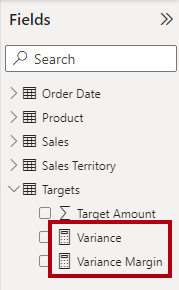

---
lab:
  title: 複合モデルを作成する
  module: Design and build tabular models
---

# <a name="create-a-composite-model"></a>複合モデルを作成する

## <a name="overview"></a>概要

**このラボの推定所要時間は 30 分です。**

このラボでは、事前に開発された DirectQuery モデルにテーブルを追加して複合モデルを作成します。

このラボでは、次の作業を行う方法について説明します。

- 複合モデルを作成する。

- モデル リレーションシップを作成する。

- メジャーを作成する。

## <a name="get-started"></a>はじめに

この演習では、環境を準備します。

### <a name="clone-the-repository-for-this-course"></a>このコースのリポジトリを複製する

1. スタート メニューで、コマンド プロンプトを開きます

    

1. コマンド プロンプト ウィンドウで、次のように入力して D ドライブに移動します。

    `d:` 

   Enter キーを押します。

    


1. コマンド プロンプト ウィンドウで、次のコマンドを入力して、コース ファイルをダウンロードし、DP500 という名前のフォルダーに保存します。
    
    `git clone https://github.com/MicrosoftLearning/DP-500-Azure-Data-Analyst DP500`
   
1. リポジトリが複製されたら、コマンド プロンプト ウィンドウを閉じます。 
   
1. エクスプローラーで D ドライブを開き、ファイルがダウンロードされていることを確認します。

### <a name="set-up-power-bi-desktop"></a>Power BI Desktop を設定する

このタスクでは、事前に開発された Power BI テンプレート ファイルを開きます。

1. エクスプローラーを開くには、タスク バーで**エクスプローラー**のショートカットを選択します。

    

1. **D:\DP500\Allfiles\08\Starter** フォルダーに移動します。

1. 事前に作成された Power BI Desktop ファイルを開くには、**Sales Analysis - Create a composite model.pbit** ファイルをダブルクリックします。 

1. 潜在的なセキュリティ リスクの承認を求めるメッセージが表示されたら、 **[OK]** を選択します。

1. SQLServerInstance、SqlServerDatabase、Culture を次に示すように入力します。 **[読み込み]** を選択します。

    SqlServerInstance = ```localhost```

    SqlServerDatabase = ```AdventureWorksDW2022-DP500```

    Culture = ```en```

    

1. SQL Server データベース接続プロンプトで、 **[接続]** を選択します。

1. [暗号化のサポート] ウィンドウで、 **[OK]** を選択します。

1. [ネイティブ データベース クエリ] ウィンドウで、 **[実行]** を選択します。

1. ファイルを保存します。 **[ファイル]** リボン タブで、 **[名前を付けて保存]** を選択します。

1. **[名前を付けて保存]** ウィンドウで、**D:\DP500\Allfiles\08\MySolution** フォルダーに移動します。 ファイル名は、Sales Analysis - Create a composite model.pbix です。

1. **[保存]** を選択します。

### <a name="review-the-report"></a>レポートを確認する

このタスクでは、事前に作成されたレポートを確認します。

1. Power BI Desktop のステータス バーの右下隅で、ストレージ モードが DirectQuery であることを確認します。

    

    DirectQuery モデルは、DirectQuery ストレージ モードを使用するテーブルで構成されます。DirectQuery ストレージ モードを使用するテーブルにより、基になるデータ ソースにクエリが渡されます。データ モデラーは、多くの場合、このストレージ モードを使用して大量のデータをモデル化します。この場合、基になるデータ ソースは SQL Server データベースです。

1. レポートのデザインを確認します。

    

    このレポート ページには、タイトルと 2 つのビジュアルがあります。スライサー ビジュアルを使用すると、単一の会計年度でフィルター処理を行うことができ、縦棒グラフ ビジュアルでは、四半期ごとの売上高が表示されます。売上目標を縦棒グラフ ビジュアルに追加して、このデザインを改善します。

1. **[会計年度]** スライサーで、 **[FY2021]** を選択します。

    

    スライサーの選択によって、縦棒グラフ ビジュアルに適用されるフィルターが変更されることを理解しておくことが重要です。Power BI では、縦棒グラフ ビジュアルが更新されます。このためには、ソース データベースからデータを取得する必要があります。そうすることで、縦棒グラフ ビジュアルに最新のソース データが示されます (レポートレベルのキャッシュが発生する可能性があります。つまり、以前にクエリされたデータがレポートで再利用される可能性があります)。

### <a name="review-the-data-model"></a>データ モデルを確認する

このタスクでは、事前に作成されたデータ モデルを確認します。

1. **[モデル]** ビューに切り替えます。

    

1. モデル図を使って、モデルのデザインを確認します。

    

    このモデルは、3 つのディメンション テーブルと 2 つのファクト テーブルで構成されます。**Sales** ファクト テーブルは販売注文の詳細を表します。これは、従来のスター スキーマ設計です。各テーブルの上部にあるバーは、そのテーブルで DirectQuery ストレージ モードが使用されていることを示します。各テーブルに青色のバーがあるため、これは、すべてのテーブルが同じソース グループに属していることを示しています。

    売上目標のファクトの分析もサポートされるようにするには、モデルを別のファクト テーブルで拡張します。

## <a name="create-a-composite-model"></a>複合モデルを作成する

この演習では、DirectQuery モデルを複合モデルに変換するインポート テーブルを追加します。

*複合モデルは、複数のソース グループで構成されます。*

### <a name="add-a-table"></a>テーブルの追加

このタスクでは、Excel ブックをソースとする売上目標を格納するテーブルを追加します。

1. **[ホーム]** リボン タブの **[データ]** グループ内から **[Excel ブック]** を選択します。

    

1. **[Open] (開く)** ウィンドウで、**D:\DP500\Allfiles\08\Assets** フォルダーに移動します。

1. **SalesTargets.xlsx** ファイルを選択します。

    

1. **[Open (開く)]** を選択します。

    

1. **[ナビゲーター]** ウィンドウで、**Targets** テーブルをオンにします。

    

1. プレビュー ペイン (右側にあります) で、テーブルが 3 つの列で構成され、テーブルの各行は、会計四半期、販売地域、目標売上額を表していることを確認します。

    

    このデータをインポートして、テーブルを DirectQuery モデルに追加します。DirectQuery を使用して Excel ブックに接続することはできないため、Power BI によってインポートされます。

1. **[データの変換]** を選択します。

    

1. 最初の列の名前を変更するには、Power Query エディター ウィンドウで、**Period** 列のヘッダーをダブルクリックします。

1. 列の名前を **Fiscal Quarter** に変更し、**Enter** キーを押します。

    

1. 3 番目の列のデータ型を変更するには、**Target Amount** 列のヘッダーで、データ型アイコン (123) を選択し、 **[固定小数点数]** を選択します。

    

1. クエリを適用するには、 **[ホーム]** リボン タブの **[閉じる]** グループ内から、 **[閉じて適用]** アイコンを選択します。

    

1. 潜在的なセキュリティ リスクに関するメッセージが表示されたら、メッセージを読み、 **[OK]** を選択します。

    

1. 読み込みプロセスが完了したら、Power BI Desktop で、モデル図の **Order Date** テーブルのすぐ下に新しいテーブルを配置します。

    テーブルが隠れて見えない場合があります。その場合、水平方向にスクロールするとテーブルが表示されます。

    

1. **Targets** テーブルの上部に青いバーがないことに注意してください。

    バーがないということは、テーブルがインポート ソース グループに属していることを示します。

### <a name="create-model-relationships"></a>モデル リレーションシップを作成する

このタスクでは、2 つのモデル リレーションシップを作成します。

1. リレーションシップを作成するには、**Sales Territory** テーブルの **Region** 列をドラッグし、**Targets** テーブルの **Region** 列にドロップします。

    

1. **[リレーションシップの作成]** ウィンドウで、 **[カーディナリティ]** ドロップダウン リストが **[一対多]** に設定されていることを確認します。

    **Sales Territory** テーブルの **Region** 列には一意の値が含まれ、**Targets** テーブルの **Region** 列には、重複する値が含まれます。ディメンション テーブルとファクト テーブルの間のリレーションシップでは、この一対多のカーディナリティが一般的です。

1. **[OK]** を選択します。

    

1. モデル図で、**Sales Territory** テーブルと **Target** テーブルの間にリレーションシップが存在していることを確認します。

1. また、そのリレーションシップの線が他のリレーションシップの線と異なって見えることにも注意してください。

    

    "切断された" 線は、リレーションシップが制限付きリレーションシップであることを示します。保証された "一" 側が存在しない場合、モデル リレーションシップは制限されます。この場合は、リレーションシップがソース グループ間にまたがるためです。クエリ時のリレーションシップの評価は、制限付きリレーションシップに対して異なる場合があります。詳細については、「[制限付きリレーションシップ](https://docs.microsoft.com/power-bi/transform-model/desktop-relationships-understand)」を参照してください。

1. 別のリレーションシップを作成します。今度は、**Order Date** テーブルの **Fiscal Quarter** 列を **Targets** テーブルの **Fiscal Quarter** 列に関連付けます。

    

1. **[リレーションシップの作成]** ウィンドウで、 **[カーディナリティ]** ドロップダウン リストが **[多対多]** に設定されていることを確認します。

    両方の列に重複する値が含まれているため、カーディナリティは、Power BI Desktop によって自動的に多対多に設定されます。ただし、クロス フィルターの既定の方向は正しくありません。

1. **[クロス フィルターの方向]** ドロップダウン リストで、 **[単一 (Order DateによってTargetsをフィルター処理)]** を選択します。

    

    ディメンション テーブルではファクト テーブルをフィルター処理するのが一般的です。このモデル デザインでは、フィルターをファクト テーブルからディメンション テーブルに伝達する必要はありません (つまり、効率的ではありません)。

1. **[OK]** を選択します。

    

### <a name="set-model-properties"></a>モデル プロパティを設定する

このタスクでは、新しいテーブルのモデル プロパティを設定します。

1. **Targets** テーブルで、**Fiscal Quarter** 列を選択します。

1. **Ctrl** キーを押しながら、**Region** 列も選択します。

1. **[プロパティ]** ペインで、**[非表示]** プロパティを **[はい]** に設定します。

    

1. **Targets** テーブルで、**Target Amount** 列を選択します。

1. **[プロパティ]** ペインの **[書式設定]** セクションで、 **[小数点以下の桁数]** プロパティを **[2]** に設定します。

    

### <a name="add-measures"></a>メジャーを追加する

このタスクでは、売上目標の差異を分析できる 2 つのメジャーを追加します。

1. **レポート** ビューに切り替えます。

    

1. メジャーを作成するには、 **[フィールド]** ペイン (右側にあります) で、**Targets** テーブルを右クリックし、 **[新しいメジャー]** を選択します。

    

1. 数式バーに、次のメジャーの定義を入力します。

    ヒント: すべてのメジャー定義は、**D:\DP500\Allfiles\08\Assets\Snippets.txt** ファイルからコピーして貼り付けることができます。 


    ```
    Variance = SUM ( 'Sales'[Sales Amount] ) - SUM ( 'Targets'[Target Amount] )
    ```


    **Variance** という名前のメジャーでは、**Sales Amount** の合計から **Target Amount** の合計を減算します。

1. **[メジャー ツール]** コンテキスト リボン タブの **[書式設定]** グループ内で、小数点以下の桁数ボックスに「**2**」を入力します。

    

1. 次のメジャー定義を使用して、別のメジャーを作成します。


    ```
    Variance Margin =

    DIVIDE (

    [Variance],

    SUM ( 'Targets'[Target Amount] )

    )
    ```


    **Variance Margin** という名前のメジャーでは、DAX [DIVIDE](https://docs.microsoft.com/dax/divide-function-dax) 関数を使用して、**Variance** メジャーを **Target Amount** 列の合計で除算します。

1. **[メジャー ツール]** コンテキスト リボン タブで、 **[書式設定]** グループ内の **[書式]** ドロップダウン リストから、 **[パーセンテージ]** を選択します。

    

1. **[フィールド]** ペインで、**Targets** テーブル内に 2 つのメジャーがあることを確認します。

    

### <a name="update-the-report-layout"></a>レポートのレイアウトを更新する

このタスクでは、新しいメジャーを使用するようにレポートを更新します。

1. レポートで、縦棒グラフ ビジュアルを選択します。

1. **[Target Amount]** フィールドを **[フィールド]** ペインから、 **[視覚化]** ペインの **[値]** ウェル内にある **[Sales Amount]** フィールドのすぐ下にドロップします。

    

1. 縦棒グラフに、売上額と目標額が表示されるようになったことを確認します。

1. 2 つのメジャーを **[ヒント]** ウェルにドラッグします。

    

1. 任意の列の上にカーソルを置くと、ヒントが表示され、メジャー値が表示されることを確認します。

    

    以上で、DirectQuery テーブルとインポート テーブルを組み合わせた複合モデルの作成が完了しました。デュアル ストレージ モードを使用するようにディメンション テーブルを設定したり、集計を追加したりすることで、モデルを最適化してクエリのパフォーマンスを向上させることができます。これらの強化機能は、別のラボの学習目的です。

### <a name="finish-up"></a>仕上げ

このタスクでは、完了作業を行います。

1. Power BI Desktop ファイルを保存します。

    

1. Power BI Desktop を閉じます。
