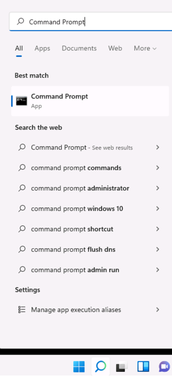

---
lab:
  title: データをリアルタイムで監視する
  module: Implement advanced data visualization techniques by using Power BI
---

# データをリアルタイムで監視する

## 概要

**ラボの推定所要時間: 30 分**

このラボでは、ページの自動更新を使用するようにレポートを構成します。 こうすることにより、レポート コンシューマーは、インターネット販売結果をリアルタイムで監視できるようになります。

このラボでは、次の作業を行う方法について説明します。

- パフォーマンス アナライザーを使用して更新アクティビティを確認する。

- ページの自動更新を設定する。

- 変更の検出機能を作成して使用する。

## はじめに

この演習では、環境を準備します。

### このコースのリポジトリを複製する

1. スタート メニューで、コマンド プロンプトを開きます

    

1. コマンド プロンプト ウィンドウで、次のように入力して D ドライブに移動します。

    `d:` 

   Enter キーを押します。

    

1. コマンド プロンプト ウィンドウで、次のコマンドを入力して、コース ファイルをダウンロードし、DP500 という名前のフォルダーに保存します。
    
    `git clone https://github.com/MicrosoftLearning/DP-500-Azure-Data-Analyst DP500`
   
1. リポジトリが複製されたら、コマンド プロンプト ウィンドウを閉じます。 
   
1. エクスプローラーで D ドライブを開き、ファイルがダウンロードされていることを確認します。

### データベースを設定する

このタスクでは、SQL Server Management Studio (SSMS) を使用し、2 つのスクリプトを実行してデータベースをセットアップします。

1. SSMS を開くには、タスク バーで、**SSMS** のショートカットを選択します。

    

2. **[サーバーに接続]** ウィンドウで、 **[サーバー名]** ドロップダウン リストが **[localhost]** に設定されており、[認証] ドロップダウン リストが **[Windows 認証]** に設定されていることを確認します。
    

3. **[接続]** を選択します。
    
    

4. スクリプト ファイルを開くには、 **[ファイル]** メニューで、 **[開く]**  >  **[ファイル]** を選択します。

5. **[ファイルを開く]** ウィンドウで、**D:\DP500\Allfiles\14\Assets** フォルダーに移動します。

6. **[1-Setup.sql]** ファイルを選択します。

    

7. **[Open (開く)]** を選択します。

    

8. スクリプトを確認します。

    このスクリプトでは、**FactInternetSalesRealTime** という名前のテーブルを作成します。インターネット販売注文のリアルタイム ワークロードをシミュレートするためのデータをこのテーブルに読み込むのは、別のスクリプトで行います。

9. スクリプトを実行するには、ツール バーで **[実行]** を選択します (または **F5** キーを押します)。

    

10. ファイルを閉じるには、 **[ファイル]** メニューで **[閉じる]** を選択します。

11. **[2-InsertOrders.sql]** ファイルを開きます。

    

12. このスクリプトも確認します。

    このスクリプトでは、無限ループを実行します。各ループでは、販売注文を挿入し、1 から 15 秒のランダムな期間遅延します。

13. スクリプトを実行し、ラボの最後まで実行したままにします。

### Power BI Desktop を設定する

このタスクでは、事前に開発された Power BI Desktop ソリューションを開きます。

1. エクスプローラーを開くには、タスク バーで**エクスプローラー**のショートカットを選択します。

    

2. **D:\DP500\Allfiles\14\Starter** フォルダーに移動します。

3. 事前に作成された Power BI Desktop ファイルを開くには、 **[Internet Sales - Monitor data in real time.pbix]** ファイルをダブルクリックします。

4. ファイルを保存するには、 **[ファイル]** リボン タブで **[名前を付けて保存]** を選択します。

5. **[名前を付けて保存]** ウィンドウで、**D:\DP500\Allfiles\14\MySolution** フォルダーに移動します。

6. **[保存]** を選択します。

### レポートを確認する

このタスクでは、事前に作成されたレポートを確認します。

1. Power BI Desktop で、レポート ページを確認します。

    

    このレポート ページには、タイトルと 2 つのビジュアルがあります。カード ビジュアルには、販売注文件数が表示され、横棒グラフ ビジュアルには、自転車サブカテゴリごとの売上高が表示されます。

2. レポートを更新するには、 **[表示]** リボン タブの **[表示]** ペイン グループで、 **[パフォーマンス アナライザー]** を選択します。

    

3. **[パフォーマンス アナライザー]** ペイン ( **[視覚化]** ペインの右側にあります) で、 **[記録の開始]** を選択します。

    

    パフォーマンス アナライザーでは、ビジュアルの更新に必要な期間を検査して表示します。各ビジュアルでは、少なくとも 1 つのクエリがソース データベースに発行されます。詳細については、「[パフォーマンス アナライザーを使用してレポート要素のパフォーマンスを確認する](https://docs.microsoft.com/power-bi/create-reports/desktop-performance-analyzer)」を参照してください。

4. **[ビジュアルを更新する]** を選択します。

    

5. レポート ビジュアルが更新され、最新のインターネット販売結果が表示されることに注意してください。

    ローカル DirectQuery モデルに接続されるレポートを作成する場合、 **[更新]** コマンド ( **[ホーム] リボン タブにあります**) を使用してレポートを更新することはできません。これは、Power BI Desktop では、代わりに DirectQuery テーブル接続が更新されるためです。レポート ビジュアルを更新するには、先ほど行った手順に従います。Power BI サービスに発行すると、レポート コンシューマーは、アクション バーで **[更新]** を選択してレポート ビジュアルを更新できます。

    リアルタイム分析用にレポートを設計する場合、ユーザーにレポート ページを常に更新するように求めるよりも効率的な方法が必要です。次の演習では、そのより効率的な方法を実現するためにページの自動更新を設定します。

## ページの自動更新を設定する

この演習では、ページの自動更新を設定し、変更の検出機能を試用します。

"ページの自動更新には、DirectQuery ストレージ モードを使用するように設定された少なくとも 1 つのモデル テーブルが必要です。

### ページの自動更新を設定する

このタスクでは、ページの自動更新を設定します。

1. レポート ページを選択するには、最初にレポート ページの空の領域を選択します。

2. **[視覚化]** ペインで、[書式] アイコン (ペイント ブラシ) を選択します。

    

3. **[ページの更新]** 設定 (一覧の最後) を **[オン]** に切り替えます。

    

    ページの自動更新はページレベルの設定です。これは、レポートの特定のページに対して有効にすることができます。

4. **[パフォーマンス アナライザー]** ペインで、レポート ビジュアルが更新されたばかりであることに注意してください。

5. **[視覚化]** ペインで、 **[ページの更新]** 設定を展開して開きます。

    

6. 既定では、ページは 30 分ごとに更新されることに注意してください。

7. この設定を、5 秒ごとにページが更新されるように変更します。

    

    重要: このように更新する間隔を頻繁にすると、このラボの作業を効率的に行うことができます。ただし、このような頻繁な更新間隔を設定すると、ソース データベースのパフォーマンスや、レポートを表示する他のユーザーに重大な影響を与える可能性があるため、注意が必要です。

    インターネット販売注文は 1 から 15 秒ごとに読み込まれるため、場合によっては、ページを更新しても同じ結果が取得されることがあります (過去 5 秒間にデータベースに注文が記録されなかったため)。可能であれば、必要なときにのみレポート ビジュアルが更新されるようにします。次のタスクでは、これを行うために変更の検出機能を設定します。

    Power BI サービスに発行した後、更新間隔を 30 分未満にするには、Premium 容量に割り当てられたワークスペースにレポートを保存する必要があります。また、容量管理者は、このような頻繁な間隔に対応できる容量を有効にして設定する必要があります。詳細については、「[Power BI でのページの自動更新](https://docs.microsoft.com/power-bi/create-reports/desktop-automatic-page-refresh)」を参照してください。

### 変更の検出を設定する

このタスクでは、変更の検出を設定します。

1. **[ページの更新]** 設定で、 **[更新の種類]** ドロップダウン リストを **[変更の検出]** に設定します。

    

2. 変更の検出のメジャーを作成するには、 **[変更の検出の追加]** リンクを選択します。

    

3. **[変更の検出]** ウィンドウで、既定の設定が、新しいメジャーの作成になっていることに注意してください。

    

4. **[計算の選択]** ドロップダウン リストで、 **[カウント (個別)]** を選択します。

    

5. **[フィールド]** ペイン (ウィンドウ内の右側にあります) で、下にスクロールして **[Internet Sales]** テーブルを見つけます。

6. **[Sales Order]** フィールドを選択します。ウィンドウで、このフィールドが **[Choose a field to apply it to](適用対象のフィールを選択する)** に追加されることに注意してください。

    

7. **[変更を確認する間隔]** 設定で、5 秒に設定します。

    

8. **[適用]** を選択します。

    

9. **[フィールド]** ペインで、 **[Internet Sales]** テーブル内に、変更の検出のメジャーが追加されていることに注意してください。

    

    Power BI で、変更の検出のメジャーを使用して 5 秒ごとにソース データベースのクエリが実行されるようになりました。毎回、Power BI によって結果が格納されるため、次回使用するときに比較できます。結果が異なる場合、データが変更されたことを意味します (この場合、データベースには、新しい販売注文が挿入されています)。この場合、Power BI により、すべてのレポート ページ ビジュアルが更新されます。

    Power BI サービスに発行すると、Power BI では、Premium 容量に関する変更の検出のメジャーのみがサポートされます。

10. **[パフォーマンス アナライザー]** ペインで、 **[クリア]** を選択します。

    

11. パフォーマンス アナライザーに変更の検出クエリが表示されることに注意してください。

12. Power BI Desktop でレポート ビジュアルが更新される前に、複数の変更の検出クエリが発生する場合があることに注意してください。

    これは、その時点で、データベースに挿入された新しいインターネット販売注文がないためです。レポート ビジュアルは必要なときにのみ更新されるため、この設定によって効率が向上しました。

### 仕上げ

このタスクでは、完了作業を行います。

1. Power BI Desktop ファイルを保存します。

    

2. Power BI Desktop を閉じます。

3. SSMS で、スクリプトの実行を停止するには、ツール バーで **[停止]** を選択します (または **Alt + Break** キーを押します)。

    

4. スクリプト ファイルを閉じます。

5. **[3-Cleanup.sql]** ファイルを開きます。

    

    このスクリプトでは、**FactInternetSalesRealTime** テーブルを削除します。

6. スクリプトを実行します。

7. SSMS を閉じます。
